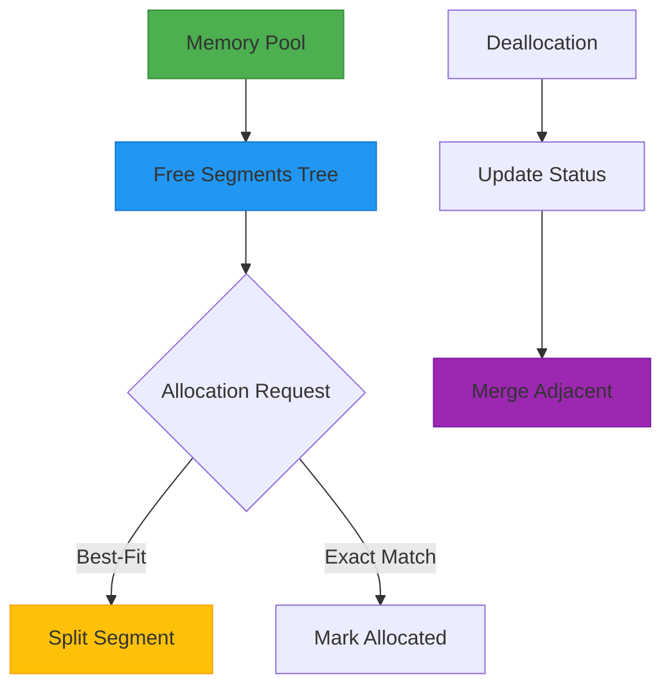

# CUDA Memory Manager 🚀

[](LICENSE)

A lightweight memory management solution for CUDA programs, utilizing red-black trees for efficient memory fragment management.



## Key Features  
- 🧩 Pre-allocated Memory Pool - Reduces CUDA API overhead
- 🔍 User-friendly - Use macro to override CUDA API  to minimize the change of your project  
- 🌳 Dual Red-Black Trees - O(log n) search/insert/delete operations  
- 🔄 Auto-merging - Coalesces adjacent free blocks  
- ⚡ 256-byte Alignment - Optimized for GPU memory access  
- 📊 Debug Tools - printMemoryPool() for real-time monitoring

## Quick Start    
### Integration  
```cpp
// Override standard CUDA memory APIs
#include "cuda_memory_manager/use_memory_manager.h" 
#include <cuda_runtime.h>  // Must follow custom includes

int main() {
    memoryManager.createBlock();  // Initialize pool
    
    float* d_data;
    size_t size = 1024 * sizeof(float);
    cudaMalloc(&d_data, size);    // Custom allocation
    
    // ... Your CUDA kernel ...
    
    cudaFree(d_data);             // Custom deallocation
    memoryManager.freeBlock();    // Release pool
    return 0;
}

```
## Core Architecture  
### Data Structures  
```cpp
struct Segment {
    void* base;         // Base address
    size_t size;        // Block size (bytes)
    bool isEmpty;       // Allocation status
    
    // Address comparison for tree ordering
    bool operator<(const Segment& other) const {
        return base < other.base;
    }
};

// Dual-index structure
std::set<Segment> ptrTree;       // Address-ordered tree
std::set<Segment, CompareSize> sizeTree;  // Size-ordered tree
```
### Allocation Workflow  
1. Alignment: Pad requests to 256-byte boundaries  
2. Best-Fit Search: Find smallest sufficient block  
3. Splitting: Divide large blocks when possible  
4. Bookkeeping: Update both trees atomically

## Best Practices  
### Configuration Tuning  
```cpp
// Adjust safety buffer (createBlock())
size_t chunkSize = free - (512 * 1024 * 1024);  // Default 512MB
```
### Error Handling  
```cpp
cudaError_t err = cudaMalloc(&ptr, size);
if (err != cudaSuccess) {
    std::cerr << "Allocation failed. Current memory state:\n";
    memoryManager.printMemoryPool();
    // Handle error...
}
```
### Performance Tips  
- Warm up memory pool before time-critical sections
- Minimize small allocations (<1MB)
- Periodically check fragmentation status  

## Contributors  
- [@jifaley](https://github.com/jifaley) - Patient instruction and essential guidance. Best gratitude!!!
- [@zjuadurey](https://github.com/zjuadurey) - Project maintainer  

## Reference Implementation  
Based on concepts from:  
https://www.canaknesil.com/docs/MAM_A_Memory_Allocation_Manager_for_GPUs.pdf  
Can Aknesil and Didem Unat. "MAM: A Memory Allocation Manager for GPUs". 5. Ulusal Yüksek Başarımlı Hesaplama Konferansı, Istanbul, Turkey. September, 2017.  

__Note__: Actual performance may vary depending on workload characteristics. Recommended for applications with repetitive allocation patterns.
